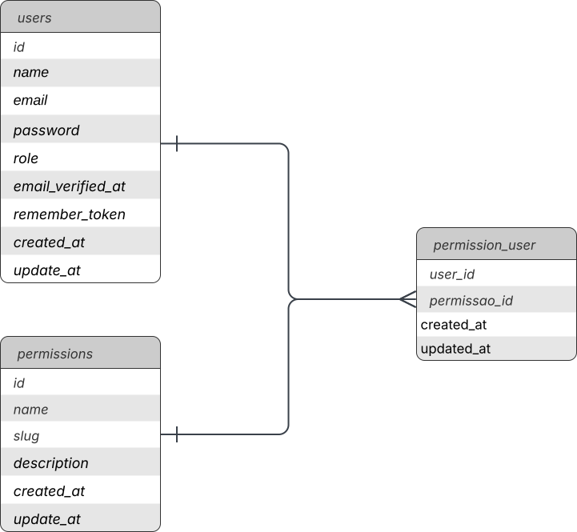

# Avaliacao Laravel - Santa Casa

Aplicação desenvolvida para o desafio técnico de Desenvolvedor de Sistemas Júnior em Laravel.

O sistema permite:

- autenticação com e-mail e senha;
- CRUD de usuários;
- CRUD de permissões;
- controle de acesso por perfil e por permissão;
- exibição de módulos operacionais de acordo com as permissões do colaborador.

## Requisitos

- PHP 8.3+
- Composer
- Node.js 20+
- NPM
- MySQL 8+ ou MariaDB

## Tecnologias utilizadas

- Laravel 13
- PHP 8.3
- MySQL
- Blade
- Tailwind CSS
- Vite
- PHPUnit
- Docker Compose para banco local

## Instalacao

1. Clone o repositorio:

```bash
git clone <url-do-repositorio>
cd teste_tecnico
```

2. Instale as dependencias do PHP:

```bash
composer install
```

3. Instale as dependencias do front-end:

```bash
npm install
```

4. Crie o arquivo de ambiente:

```bash
cp .env.example .env
```

No Windows PowerShell:

```powershell
Copy-Item .env.example .env
```

5. Gere a chave da aplicacao:

```bash
php artisan key:generate
```

## Configuracao

Ajuste as variaveis de banco no arquivo `.env`.

Exemplo:

```env
DB_CONNECTION=mysql
DB_HOST=127.0.0.1
DB_PORT=3306
DB_DATABASE=santa_casa
DB_USERNAME=root
DB_PASSWORD=password
```

Se desejar, o projeto possui um `docker-compose.yml` com MySQL e Adminer.

Para subir os containers:

```bash
docker compose up -d
```

Servicos:

- MySQL: `127.0.0.1:3306`
- Adminer: `http://127.0.0.1:8081`

## Migrations e seeders

Para criar as tabelas e popular os dados iniciais:

```bash
php artisan migrate:fresh --seed
```

## Execucao

Backend:

```bash
php artisan serve
```

Frontend:

```bash
npm run dev
```

A aplicacao ficara disponivel em:

- `http://127.0.0.1:8000`

## Credenciais iniciais

Administrador:

- E-mail: `admin@santacasa.org.br`
- Senha: `password`

Colaborador de teste:

- E-mail: `colaborador@santacasa.org.br`
- Senha: `password`

Permissoes iniciais do colaborador de teste:

- Unidades Assistenciais
- Equipamentos

## Regras implementadas

- O usuario `admin` acessa apenas as areas administrativas:
  - Usuários
  - Permissões
- O usuario `colaborador` acessa apenas os módulos vinculados as suas permissões.
- O acesso não depende apenas do menu: rotas tambem sao protegidas.
- O admin não utiliza os modulos operacionais.
- Ao editar um usuario com perfil `admin`, as permissoes não são aplicadas. Se o perfil for alterado para `colaborador`, as permissões podem ser selecionadas.
- Não é permitido excluir uma permissão que esteja vinculada a usuários.

## Módulos disponíveis

Os módulos operacionais implementados para validação do controle de acesso são:

- Setores Hospitalares
- Especialidades Medicas
- Equipamentos
- Unidades Assistenciais

Cada módulo possui uma página simples com nome e descrição.

## Diagrama do banco

A aplicação utiliza relacionamento many-to-many entre usuários e permissões, por meio da tabela pivô `permission_user`.



## Decisões técnicas

- Foi utilizada autenticação nativa do Laravel com `Auth::attempt`.
- O sistema usa relacionamento many-to-many entre `users` e `permissions`.
- A autorização administrativa foi centralizada com `Policies`.
- O controle de acesso aos mpódulos foi mantido por permissão na rota.
- A listagem de usuários utiliza busca simples, eager loading `with('permissions')` e paginação com 10 itens por página para otimização de query.
- A listagem de permissões também possui busca e paginação.
- As validações foram reforçadas com regras de formato, unicidade e limites de tamanho.
- Foram adicionadas telas personalizadas para erros `403` e `404`.

## Estrutura resumida

- `app/Http/Controllers`
  - `HomeController`
  - `UserController`
  - `PermissionController`
- `app/Policies`
  - `UserPolicy`
  - `PermissionPolicy`
- `resources/views`
  - login
  - home
  - users
  - permissions
  - modules
  - errors

## Checklist do desafio

### Obrigatorios

- [x] Autenticação com e-mail e senha
- [x] CRUD completo de usuários
- [x] CRUD completo de permissões
- [x] Controle de acesso por rota
- [x] Página simples para os módulos
- [x] Migrations
- [x] Seeders
- [x] Usuário administrador inicial
- [x] README com instalação, configuração, execução e credenciais

### Diferenciais implementados

- [x] Policies
- [x] Tratamento de exceções com paginas 403 e 404
- [x] Validações robustas
- [x] Busca e paginação nas listagens
- [x] Interface responsiva simples com Tailwind


## Como validar rapidamente

1. Rode:

```bash
php artisan migrate:fresh --seed
```

2. Inicie a aplicacao:

```bash
php artisan serve
npm run dev
```

3. Entre com o admin e valide:

- acesso a `Usuarios`;
- acesso a `Permissoes`;
- bloqueio ao tentar abrir modulo operacional.

4. Entre com o colaborador e valide:

- visualizacao apenas dos modulos permitidos;
- bloqueio `403` ao tentar acessar telas administrativas;
- bloqueio ao tentar acessar modulo sem permissao.